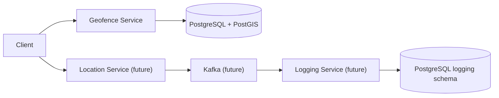

# Geofence Service

This service is part of a larger event-driven mobility platform architecture.

It is responsible for managing geofence areas and storing spatial data using PostgreSQL + PostGIS.

The implementation prioritizes architectural correctness, strict service boundaries, clean layering, and future scalability over rapid prototyping.

---

## System Context

This repository is part of a microservice system built with:

- NestJS
- TypeScript
- PostgreSQL
- PostGIS
- Prisma
- Kafka (future steps)
- Docker Compose

Repository structure:

```text
root/
  apps/
    geofence-service
    location-service
    logging-service
  libs/
    contracts
  infra/
    docker-compose.yml
```

Only the **Geofence Service** is implemented in this step.

Other services will be implemented in future steps.

---

## Service Responsibilities

The Geofence Service is responsible for:

- managing geofence areas
- storing geofence polygons in PostGIS
- exposing APIs to create and list geofence areas

Future responsibilities in the broader system:

- Location Service will ingest user locations
- detect polygon containment
- detect transitions (outside → inside)
- publish `UserEnteredArea` events via Kafka

The Geofence Service remains independent and does not depend on other services.

---

## API Endpoints

### POST /areas

Creates a geofence area defined as a circle.

Request body:

```json
{
  "name": "Example Area",
  "centerLat": 41.0128,
  "centerLon": 28.9784,
  "radiusM": 500
}
```

Behavior:

The circle definition is converted into a polygon using PostGIS:

```sql
ST_Buffer(
  ST_SetSRID(ST_MakePoint(lon, lat), 4326)::geography,
  radius_m
)::geometry
```

The resulting polygon is stored in the PostGIS geometry column.

Response:

```json
{
  "id": "uuid",
  "name": "Example Area",
  "createdAt": "timestamp"
}
```

---

### GET /areas

Returns stored geofence areas.

Minimal response fields:

- id
- name
- createdAt

Pagination is intentionally deferred for this step.

---

### GET /health

Checks service readiness.

The endpoint performs a lightweight database check.

Example response:

```json
{
  "status": "ok",
  "service": "geofence-service"
}
```

---

## Architecture

The service follows **Clean Architecture / Hexagonal Architecture** principles.

```text
src/
  domain/
    - entities
    - value objects
    - domain rules
  application/
    - use cases
    - repository interfaces
  infrastructure/
    - Prisma repository implementations
    - database access
    - migrations
  presentation/
    - HTTP controllers
    - DTO validation
```

Key principles:

- domain layer is framework-agnostic
- controllers remain thin
- business rules live in domain/use cases
- repository pattern isolates persistence
- PostGIS operations remain in infrastructure

---

## Architecture Decision Highlights

### Clean Architecture Layering

The system separates domain, application, infrastructure, and presentation layers.

This ensures:

- domain logic remains independent of frameworks
- infrastructure changes do not impact core business logic
- business rules remain testable.

### Domain Validation via Value Objects

Domain invariants are enforced through value objects:

- AreaName
- GeoCircle

DTO validation protects the HTTP boundary, while value objects enforce domain correctness.

### Repository Pattern for Persistence Isolation

Repository interfaces live in the application layer.

Infrastructure implements them using Prisma.

This allows:

- database changes without domain impact
- clean unit testing
- isolation of persistence concerns.

### PostGIS for Geospatial Computation

Geospatial calculations are delegated to PostGIS using:

- `ST_Buffer`
- `ST_SetSRID`
- `ST_MakePoint`

This ensures spatial correctness and high performance.

### GIST Index for Spatial Queries

A GIST index is created on the geometry column.

This enables efficient spatial queries such as:

- `ST_Covers`
- `ST_Contains`
- large-scale geofence lookups.

### Transaction-Safe Area Creation

Area creation runs inside a database transaction.

This guarantees atomic persistence of geometry data.

### Future-Ready Microservice Boundaries

The service is designed as an independent bounded context.

Future services will include:

- Location Service
- Kafka event publishing via Outbox
- Logging Service with idempotent consumers.

---

## Architecture Diagram



Only the Geofence Service is implemented in this step.

### Request Lifecycle

Lifecycle of `POST /areas`:

1. HTTP request reaches `AreasController`
2. DTO validation occurs at the presentation boundary
3. Controller calls `CreateAreaUseCase`
4. Domain value objects (`AreaName`, `GeoCircle`) are constructed
5. Domain validation enforces invariants
6. Use case calls `AreaRepository` interface
7. `PrismaAreaRepository` persists the geometry using PostGIS
8. Geometry is stored as `geometry(Polygon, 4326)`
9. Response DTO is returned to the client.

---

## Database Design

Schema: `geofence`

Table: `geofence.areas`

Columns:

- `id` UUID
- `name` TEXT
- `geom` geometry(Polygon, 4326)
- `created_at` TIMESTAMP

PostGIS extension is enabled.

A GIST index exists on the geometry column.

---

## Database and PostGIS Notes

Geofence areas are stored as real PostGIS geometry.

A circle definition is converted into a polygon using `ST_Buffer`.

Benefits:

- accurate geospatial calculations
- spatial indexing support
- compatibility with `ST_Covers` / `ST_Contains`.

Application-level polygon approximations are intentionally avoided.

---

## Local Development Runbook

Prerequisites:

- Node.js
- Docker
- PostgreSQL/PostGIS via Docker Compose

Install dependencies:

```bash
npm install
```

Run migrations:

```bash
npx prisma migrate deploy
```

Start the service:

```bash
npm run start:dev
```

Service will run on:

`http://localhost:PORT`

---

## Example API Usage

Create area:

```bash
curl -X POST http://localhost:PORT/areas \
  -H "Content-Type: application/json" \
  -d '{
    "name": "Test Area",
    "centerLat": 41.0128,
    "centerLon": 28.9784,
    "radiusM": 500
  }'
```

List areas:

```bash
curl http://localhost:PORT/areas
```

Health check:

```bash
curl http://localhost:PORT/health
```

---

## Testing Strategy

Planned testing approach:

- unit tests for use cases
- controller tests with mocked repositories
- integration tests for Prisma/PostGIS repository

PostGIS spatial behavior should be tested against a real database using Testcontainers instead of mocking.

Due to time constraints, this submission prioritizes architectural correctness and end-to-end functionality.

---

## Trade-offs and Deferred Work

The following items were intentionally deferred:

- pagination for `GET /areas`
- structured logging
- Kafka producer integration
- Location Service implementation
- Logging Service implementation
- repository integration tests

These decisions were made to focus on architectural correctness for this step.

---

## Future Roadmap

Next steps for the system:

1. **Implement Location Service**
   - ingest user locations
   - detect inside/outside transitions
   - maintain `user_area_state`
   - publish events via Outbox pattern
2. **Implement Logging Service**
   - consume `UserEnteredArea` events
   - idempotent consumer design
   - persist entry logs
3. **Production improvements**
   - structured logging
   - distributed tracing
   - pagination
   - expanded test coverage.
